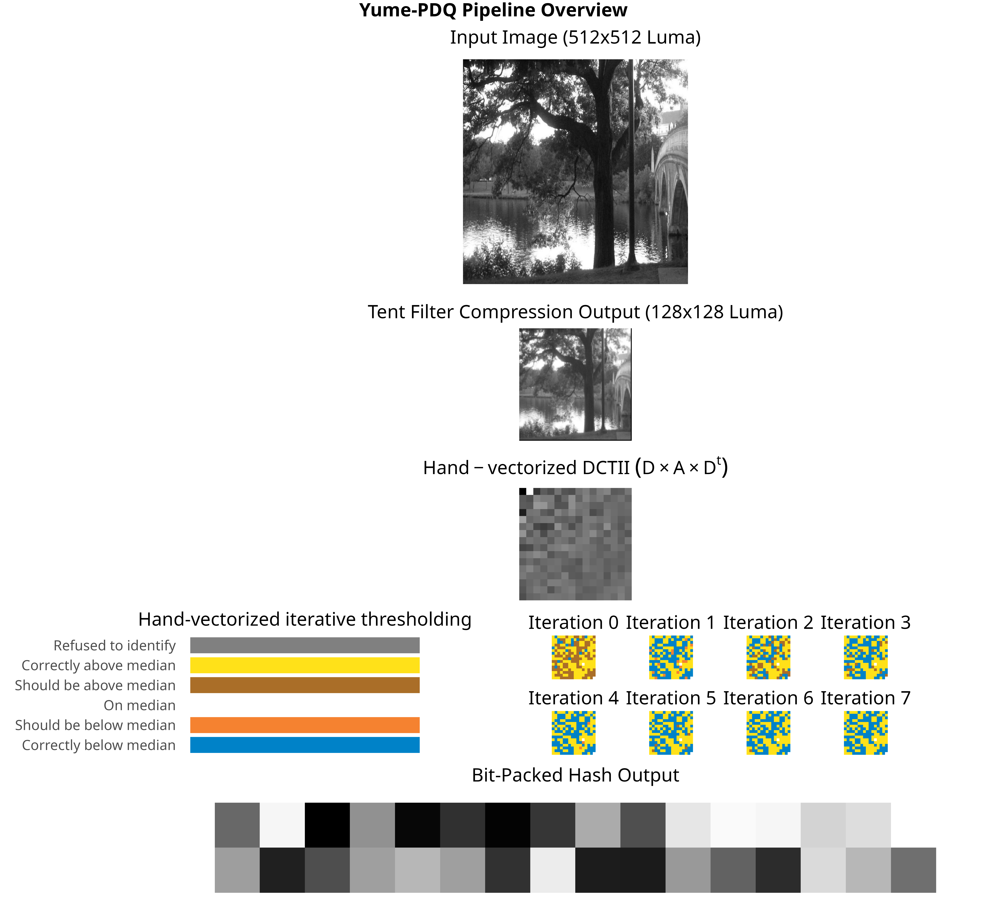
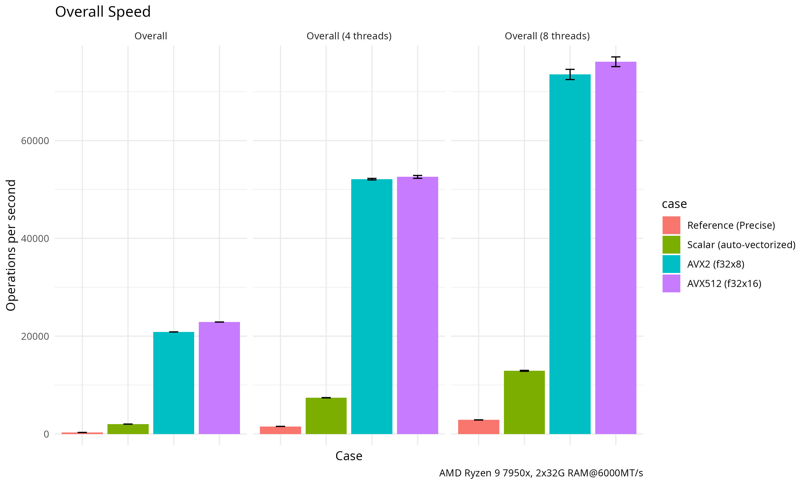
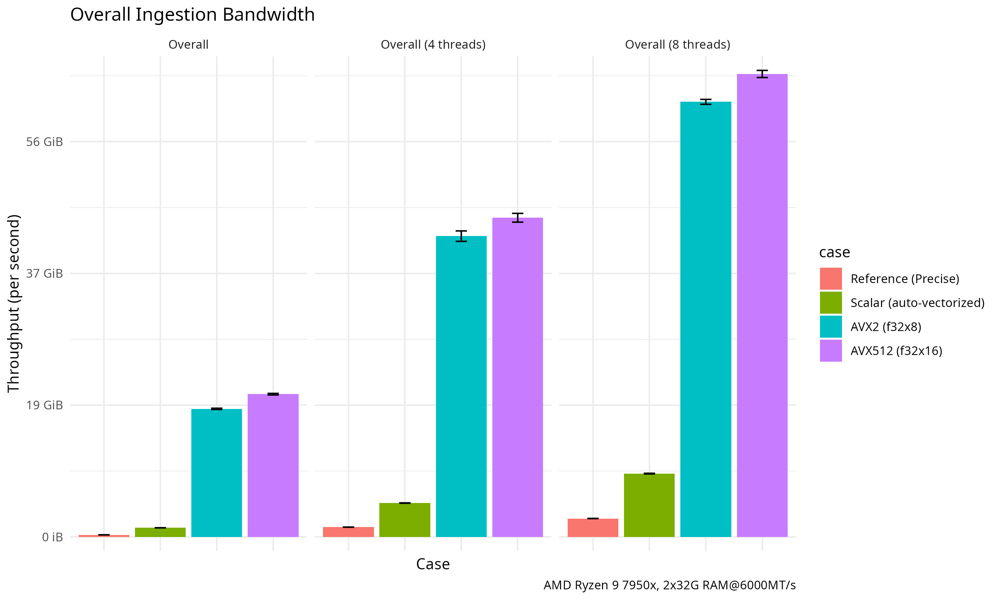
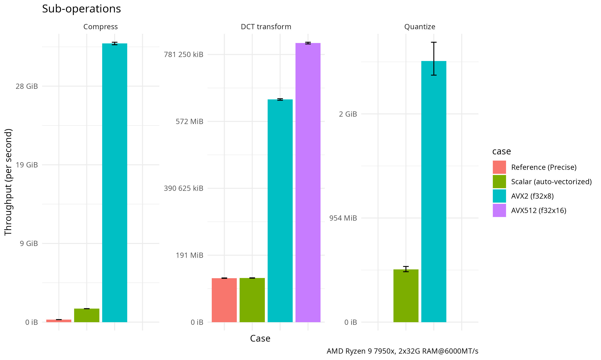
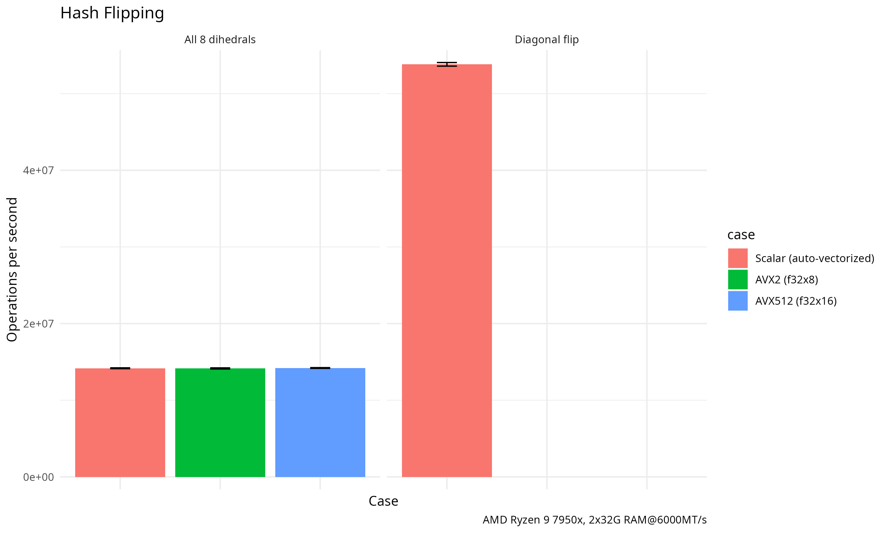
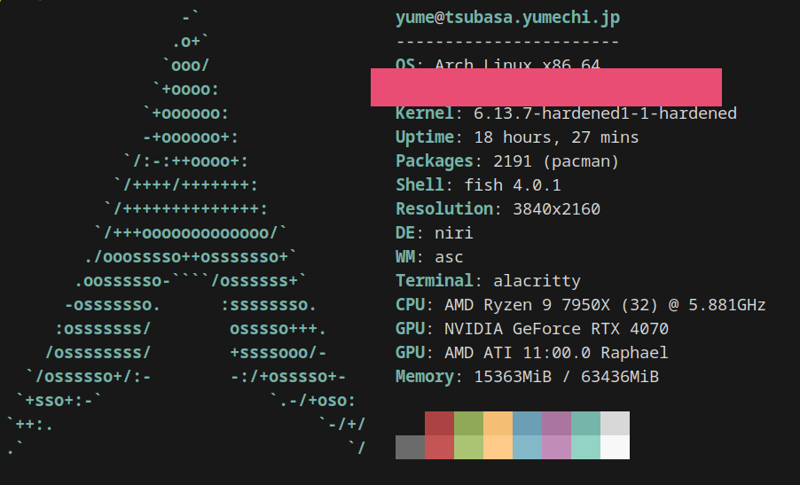

# yume-pdq

[](https://github.com/eternal-flame-AD/yume-pdq/actions/workflows/build.yml)
[](https://docs.rs/yume-pdq/)

A hand-vectorized implementation of the Facebook Perceptual Hash ([PDQ](https://github.com/facebook/ThreatExchange/tree/main/pdq)) estimation algorithm that prioritizes low latency, high throughput with statistically low upper-bound false negative rate, with options of using AVX2 intrinsics, "portable-simd" (nightly only), or AVX512 intrinsics (nightly only), with no-std and LLVM SafeStack+CFI hardening support.

## Table of Contents

- [yume-pdq](#yume-pdq)
  - [Table of Contents](#table-of-contents)
  - [Design Goals](#design-goals)
  - [System Requirements](#system-requirements)
    - [Building](#building)
    - [Execution](#execution)
  - [Releases](#releases)
  - [Pipeline Overview](#pipeline-overview)
  - [Binary usage](#binary-usage)
  - [FFI (C/Python) usage](#ffi-cpython-usage)
  - [Benchmark](#benchmark)
    - [Formal](#formal)
    - [Empirical / End-to-end](#empirical--end-to-end)
      - [Video Processing](#video-processing)
      - [Image Processing](#image-processing)
    - [Why is my performance lower?](#why-is-my-performance-lower)
  - [Accuracy on test set](#accuracy-on-test-set)
  - [API Usage (and dihedral transformations)](#api-usage-and-dihedral-transformations)
  - [License and attributions](#license-and-attributions)

## Design Goals

Fit into an existing image processing pipeline rather than defining our own, if a server is processing UGC images they likely already are doing resizing, and adding a couple microseconds of CPU time per request can make a large difference vs. milliseconds for a high level API that takes arbitrary image, resize it (again, potentially doubling latency) and do a faithfully precise hash (drains more CPU time from the server).

Parallelize well up to the memory bandwidth limit.

Be _accurate enough_ for high-throughput and real-time screening when there is a human user waiting for the result and/or the server CPU time is constrained. At present, the official docs require 10 bits when quality > 0.8 to be considered "correct" and we are currently right on the border (see [Accuracy on test set](#accuracy-on-test-set)). However the threshold for matching is 31 bits so we consider this not important for the purpose of matching. This also means you _should NOT_ submit hashes to databases using output of any optimized kernels in this library.

Our definition of "accurate enough to match" was based on a worst-case FNR (false negative rate) computed using birthday paradox, assuming such as statistical model:

  - We have an unknown "ground truth" in the DCT transformation that perfectly captures the original image (the "truth" that stays consistent across minor transformations PDQ was designed to detect)
  - We have an official definition of "positive" images generated using a lossy DCT, to match with our, also lossy DCT.
  - An image is a "positive" if the number of bit flips between the two lossy DCTs is less than 31 bits (per official definition).
  - We can assume a worst-case scenario that results in a birthday paradox scenario, where:
      1. Bits are all i.i.d. uniform variables (i.e. no parts of an hash are more malleable than others, in reality some parts of hash are much more likely to flip than others)
      2. All bit-flips happen to make the two lossy implementations diverge (in reality this this is also subject to probability, but we assume the worst-case)
      3. The reference implementation is perfect in that it is stable in itself against minor transformations.

  This yields `(1 / 2^((31 - $worst_distance) / 2)) * 100% / $test_set_size`, which currently computes to 0.069% upper bound FNR (24 bits) for the 100 images in DISC21 test set ([logs](fnr-rest/log.txt)) (by assuming all images are as "bad" as the 2 out of 100 images that yielded this difference), and 0.00076% when using a more optimistic average distance (11 bits) to estimate this. It should also be noted that PDQ is a perceptual hash and can be malleable to imperceptible transformations (such as minor warping), thus an on-average 10-bits off implementation does not translate to 1024 times higher FNR in real-world fuzzy matching.

  - The main hypothesized source of difference than a faithful implementation is because of a changed size of input dimension for DCT2D transformation (we increased to 127x127 from the official 64x64 to make the loss from the compression from 512x512 lower and adapt to modern CPU architecture), which could potentially capture _more_ input information to compress into frequency domain (as DCT2D has ~4x more pixels to "sample" frequency domain information from) leading to a different numerical result, but is actually more stable on such malleable images with very sharp edges. If this hypothesis holds, the real-world FNR is likely orders-of-magnitude lower than the naive birthday paradox estimate above.

  - To further reduce possibility of errors when both performance and accuracy are important, it is recommended to use yume-pdq in a "hash filter"-like configuration (i.e. increasing the threshold for a "potential match" by another 8 bits to (to 39 bits), and perform a more precise comparison if the image was flagged as a "potential match").

Hand-written SIMD is unsafe and you shouldn't trust me, the kernel themselves are written with consideration to minimize possible issues by:
  -  not having data-dependent jumps or data-dependent indexing
  -  Add debug time bound assertions to catch SIMD reading out of bounds at test time
  -  As defense-in-depth and to mitigate data-only exploits I provide backwards CFI (LLVM SafeStack) and forward CFI (LLVM CFI) hardened-builds (marked with `-cfi` suffix in release binaries) thanks to a zero-runtime dependency policy on library builds and minimal runtime dependencies on binaries. They affect performance by <10% when used in isolation due to the kernel having no CFI-required indirect jumps. Backwards CFI protects against almost all forms of ROP-based attacks that operate on the stack, and forward CFI protects against indirect jumps (such as IO dispatches based on a function pointer from being overwritten to malicious code).

No-std support.

## System Requirements

### Building

- Rust toolchain (2024 edition or newer (1.85.0 or newer))
- To build for AVX2, you can use any Rust channel and only `RUSTFLAGS="-Ctarget-feature=+avx2,+fma"` is required.
- To build for AVX512, you need a nightly toolchain, and your build platform must also have AVX512, and `--features avx512`, and `RUSTFLAGS="-Ctarget-feature=+avx512f"` is required.
- To build for portable-simd, you need a nightly toolchain, and `--features portable-simd` is required.

### Execution

- A CPU that is the same ISA as the binary (of course)
- The portable-simd kernel is adaptive to your platform architecture and falls back to scalar instructions if necessary, I have tested on Apple Silicon (NEON) and Google Pixel 9 Pro (SVE2), both results in 4x+ speedup over the generic auto-vectorized scalar kernel.
- To use f32x8 AVX2 kernel, you need an x86_64 CPU with AVX2 and FMA support
- To use f32x16 AVX512 kernel, you need an x86_64 CPU with AVX512F support
 
## Releases

We provide pre-built binaries, shared objects, and static libraries for Linux, macOS, and Windows, currently for these combinations:

- Linux: 
  - x86_64 sse4.2_portable_simd/avx2_intrinsic/avx2_portable_simd 
    - statically linked with musl 
    - each also has an accompanying CFI-hardened version linked with glibc
- MacOS (not part of official release due to lack of hardware, only available as [per-build artifacts](https://github.com/eternal-flame-AD/yume-pdq/actions/workflows/macos.yml))
  - aarch64 neon 
    - end-to-end tested on GitHub Actions
- Windows: 
  - x86_64 sse4.2_portable_simd/avx2_intrinsic/avx2_portable_simd
    - cross compiled using gnu toolchain
    - Not end-to-end tested on CI but built using identical code to Linux builds
    - No OS-specific conditional compilation used

You can download the binaries from the [GitHub release page](https://github.com/eternal-flame-AD/yume-pdq/releases).

## Pipeline Overview



## Binary usage

To save cloning this repo if you just want a published version (check on [crates.io](https://crates.io/crates/yume-pdq)), replace `cargo build --release` with `cargo install yume-pdq[@<version>]`.

Compilation for your own CPU (AVX2 if available, falls back to an auto-vectorized scalar kernel) is done usually with:

```bash
RUSTFLAGS="-Ctarget-cpu=native" cargo build --release --features "cli"
```

If you want a generic binary that only assumes AVX2 and FMA is available to use the optimized kernel, you can build with:

```bash
RUSTFLAGS="-Ctarget-feature=+avx2,+fma" cargo build --release --features "cli"
```

If your CPU has AVX512, you can also try (with a Rust nightly compiler):

```bash
RUSTFLAGS="-Ctarget-cpu=native" cargo +nightly build --release --features "cli avx512"
RUSTFLAGS="-Ctarget-feature=+avx512f" cargo +nightly build --release --features "cli avx512"
```

and see if it is faster, it may not be, especially with older generations of AVX512 CPUs, and it makes the final binary highly specific to your CPU (even other AVX512 CPUs may get #UD on your `-Ctarget-cpu=native` binary).


See [binary_usage.md](binary_usage.md) or the CLI help menu for details and practical examples.

## FFI (C/Python) usage

This library can be built as a shared object that can be used by C/Python applications, or a static library that can be linked into your systems programming application.

Currently there is only one exported symbol.

See [integration/dummy.c](integration/dummy.c) for an example of how to use this library from C.

See [integration/hash.py](integration/hash.py) for an example of how to use this library from Python.

You can download a pre-built AVX2 shared object from GitHub release artifacts but I recommend building it for your specific machine for best assurance that it would work and performance.

```py
python integration/hash.py test-data/aaa-orig.jpg
Image: test-data/aaa-orig.jpg
Quality: 1.000
Threshold: 12.554
Hash: 58f8f0cee0f4a84f06370a32038f67f0b36e2ed596621e1d33e6b39c4e9c9b22
Starting 1000 iterations
Finished 1000 iterations
Average Time taken: 6628.865 us
Average conversion time: 6546.036 us
Average hash time: 80.998 us
```

## Benchmark

### Formal

Generated by criterion on an AMD Ryzen 9 7950X (Zen 4, 4.5Ghz/5.1Ghz, 81M total cache, DDR5-5200) with two 32GiB DDR5 6000MT/s RAM, empty places below means there are no hand-tuned implementation for that operation (i.e. that operation is "downgraded" to the next most vectorized implementation).

|                                                             |                                                 |
| ----------------------------------------------------------- | ----------------------------------------------- |
|  |     |
|              |  |


### Empirical / End-to-end

#### Video Processing

Two different sources are used to test the end-to-end performance of the final CLI binary that ingest raw video frames.

Random source is generated by `yume-pdq random-stream`, FFMPEG SMPTE is a constant stream of SMPTE bars generated with:

```sh
ffmpeg -hide_banner -loglevel error -f lavfi -i testsrc=size=512x512:rate=1  -pix_fmt gray  -f rawvideo -
```

Finally each kernel is tested against both sources. FPS was collected by running `yume-pdq pipe --stats` and recording the output.

| Vectorization                               | Random Source | FFMPEG SMPTE |
| ------------------------------------------- | ------------- | ------------ |
| AVX512                                      | 7900 fps      | 4050 fps     |
| AVX2                                        | 7100 fps      | 4100 fps     |
| Scalar Auto Vectorized                      | 1600 fps      | 1500 fps     |
| Google Pixel 9 Pro (SVE2 by portable-simd)  | 1478/255 fps  | N/A          |
| Google Pixel 9 Pro (scalar auto vectorized) | 220/90 fps    | N/A          |

* Smartphone SoCs have high performance cores and power-efficient cores, Android throttles heavy workload on power-efficient cores quickly so there are two numbers for burst and sustained performance.

AVX2 was able to saturate the speed FFMPEG can generate SMPTE bars.

Additionally, the format of the output (hex, binary, or raw, or prefixed with a quality score) does not significantly affect the throughput except the 7600 fps cases.

#### Image Processing

When using the imagemagick `convert` command default resizing kernel (Mitchell-Netravali) is used, 1000 images are processed in 26 seconds.

```bash
for i in (seq 1 1000); ln -s (realpath test-data/aaa-orig.jpg) /tmp/test/$i.jpg; end

time convert 'test-data/*' -resize 512x512! -colorspace gray -depth 8 gray:-  | yume-pdq pipe -f 'hex+lf'

Executed in   26.01 secs    fish           external
usr time   47.76 secs    0.00 millis   47.76 secs
sys time    9.43 secs    2.77 millis    9.43 secs
```

### Why is my performance lower?

Note that yume-pdq is a _memory bandwidth_ bound implementation, so the performance is not linear or even monotonic w.r.t. the speed of your CPU, instead it is the amount of memory bandwidth available to the CPU.

Rough numbers for two other platforms which supports my proposition:

2020 Intel Duo Xeon Gold 6230R (2.10Ghz/4.00Ghz, 35.75M total cache (much lower than mine), DDR4-2933): Scalar 250fps Vector 500fps, still faster but significant regression!

2022 AMD EPYC™ 9634 KVM (2.25Ghz/3.7Ghz, 384M total cache (much higher than mine), DDR5-4800 shared with other tenants) VPS by vendor "N" (resource is exclusive to me): Scalar 700fps Vector 2700fps, not as bad but still not as fast as the demo system.

If you are on a supercomputer or a multi-socket cluster, you can start 1 instance of yume-pdq and use the `--core0` and `--core1` options to bind the two ping-pong buffer worker process on NUMA node #0, 1 other instance and bind both threads to NUMA node #1, and so on. This will allow you to use the full memory bandwidth and cache availability of the system. The core affinity flags are only available with the `--features hpc` feature due to requiring a runtime dependency.


## Accuracy on test set

The accuracy was done by writing unit tests that do pairwise comparison with either the "pdqhash" high level API or the 32-bit floating point reference implementation or the 96-bit floating point reference implementation.

Note:

- higher distance to the `pdqhash` library is expected as they have mandatory preprocessing steps that cannot be slipped by the exposed API. The "reference" implementation is a more faithful pairwise comparison.

- Each push and tag on GitHub Actions runs this exact test suite on all Linux and MacOS builds, you can refer to the logs for that specific commit/tag to verify.

- the official "10 bit is correct" threshold is based on real image test vectors, not anime or drawn images, and certainly not terminal screenshots.
  the reason you see the official test vector have much better precision is because real photos have smoother edges, and JPEG compression is also based on DCT transformation which make the frequency domain information more pronounced (see the code example below to help visualize this). However animated images and neofetch screenshots have sharp and sharper edges all throughout the image, which "blurs" the hash and creates more "ambiguous" bits.

| Image                                          | Kernel  | Distance vs pdqhash lib | Distance vs Ref32 | Distance vs Ref96 |
| ---------------------------------------------- | ------- | ----------------------- | ----------------- | ----------------- |
|  | AVX2    | 6/256 (2.3%)            | 4/256 (1.6%)      | 4/256 (1.6%)      |
| official test vector                           | AVX512  | 6/256 (2.3%)            | 4/256 (1.6%)      | 4/256 (1.6%)      |
|                                                | Default | 6/256 (2.3%)            | 4/256 (1.6%)      | 4/256 (1.6%)      |
|                                                | Ref32   | 6/256 (2.3%)            | -                 | 0/256 (0.0%)      |
|     | AVX2    | 16/256 (6.2%)           | 10/256 (3.9%)     | 10/256 (3.9%)     |
| Drawn anime image                              | AVX512  | 16/256 (6.2%)           | 10/256 (3.9%)     | 10/256 (3.9%)     |
|                                                | Default | 16/256 (6.2%)           | 10/256 (3.9%)     | 10/256 (3.9%)     |
|                                                | Ref32   | 16/256 (6.2%)           | -                 | 0/256 (0.0%)      |
|     | AVX2    | 10/256 (3.9%)           | 8/256 (3.1%)      | 8/256 (3.1%)      |
| More "realistic" anime image                   | AVX512  | 10/256 (3.9%)           | 8/256 (3.1%)      | 8/256 (3.1%)      |
|                                                | Default | 10/256 (3.9%)           | 8/256 (3.1%)      | 8/256 (3.1%)      |
|                                                | Ref32   | 10/256 (3.9%)           | -                 | 0/256 (0.0%)      |
|  | AVX2    | 27/256 (10.5%)          | 10/256 (3.9%)     | 11/256 (4.3%)     |
| Terminal screenshot                            | AVX512  | 27/256 (10.5%)          | 10/256 (3.9%)     | 11/256 (4.3%)     |
|                                                | Default | 26/256 (10.2%)          | 10/256 (3.9%)     | 10/256 (3.9%)     |
|                                                | Ref32   | -                       | -                 | 0/256 (0.0%)      |

## API Usage (and dihedral transformations)

The Rust API is fully generic over almost all possible parameters, so you don't need to remember constants or write these magic numbers in your code, you can just use type inference provided by generic_array and typenum crates.

```rust
use generic_array::sequence::{Flatten, GenericSequence};
use core::f32::consts::PI; // no-std compatible (except the printing part)
use yume_pdq::{GenericArray, smart_kernel};

fn main() {
    // Fill with horizontal FM pattern - expect a strong horizontal frequency component in the DCT response
    // this demonstrates the "thing" DCT does: "it 'wraps' one level of frequency domain information into spatial domain"
    // if we just do a sine wave without modulation, it will end up as a constant matrix and quality will be 0.
    let mut frequency = 4.0; // create 4 waves of stripes
    let modulation = frequency / 512.0; // make it exactly a whole number w.r.t. the matrix width so it shows up as nice vertical stripes.
    let input: GenericArray<GenericArray<f32, _>, _> = GenericArray::generate(|_| {
        GenericArray::generate(|j| {
            frequency += modulation;
            let value = ((j as f32 * 2.0 * PI * frequency) / 512.0).sin();
            // Scale to 0-255 range and center around 128
            (value * 127.0) + 128.0
        })
    });

    // Get the optimal kernel for your CPU and compile time flags
    let mut kernel = smart_kernel();

    // Allocate output and temporary buffers
    let mut output = GenericArray::default(); // Will contain the final 256-bit hash
    let mut buf1 = GenericArray::default(); // Temporary buffer
    let mut row_tmp = GenericArray::default(); // Temporary buffer
    let mut pdqf = GenericArray::default(); // Temporary buffer (PDQF unquantized hash)

    let mut threshold = 0.0; // value used for thresholding the hash, useful for doing different hashes with dihedral transformations
    // Compute the hash
    let quality = yume_pdq::hash_get_threshold(
        &mut kernel,
        &input,
        &mut threshold,
        &mut output,
        &mut buf1,
        &mut row_tmp,
        &mut pdqf,
    );

    // computing hashes with dihedral transformations can be done more efficiently by transforming the "pdqf buffer"
    // see: https://github.com/darwinium-com/pdqhash/blob/1a5f66f635758ee441d8884e1c15203a2ace995d/README.md#consider-additional-image-transformations
    // a generic API is available in kernel::threshold that helps recompute the final hash from a transformed pdqf buffer

    // this does the same thing but not require you to ask for a threshold
    let quality_easy = yume_pdq::hash(
        &mut kernel,
        &input,
        &mut output,
        &mut buf1,
        &mut row_tmp,
        &mut pdqf,
    );

    assert_eq!(quality, quality_easy);

    println!(
        "Image quality score: {} (threshold at {})",
        quality, threshold
    );

    // The sine wave should create a strong response in the DCT coefficients
    // Print the unquantized hash (pdqf) to see where the energy concentrates
    println!("\nUnquantized hash (PDQF) - should show horizontal frequency component of 4 (vertical stripes):");

    for row in pdqf.iter() {
        for &val in row.iter() {
            print!("{:5.1} ", val);
        }
        println!();
    }

    /*
    You should see:
     18.5  0.1  12.2  12.9  4.9  0.4  22.4 -14.0   9.9 -0.5   18.2   18.0  0.7   5.8   19.4  -14.0
    -14.3  0.4  -7.6  13.2  0.8  0.4 -18.7 -13.8  -4.2  0.0  -13.6   18.3  7.1   5.5  -15.0  -14.1
     18.8  0.0  12.3  13.2  4.9  0.3  22.8 -14.3  10.0 -0.5   18.4   18.5  0.6   5.9   19.6  -14.4
    -14.3  0.4  -7.6  13.7  0.8  0.3 -18.7 -14.5  -4.2 -0.0  -13.7   19.1  7.1   5.7  -15.0  -14.8
     19.5 -0.0  12.5  14.1  4.7  0.3  23.6 -15.5  10.2 -0.6   18.9   19.8  0.6   6.2   20.0  -15.6
    -14.4  0.3  -7.6  15.4  0.8  0.2 -18.8 -16.6  -4.2 -0.2  -13.7   21.5  7.1   6.3  -15.1  -17.0
     22.2 -0.3  12.3  18.4  2.8  0.1  26.6 -21.0  10.5 -1.2   20.2   26.0 -0.4   7.8   20.4  -21.3
    -13.9  7.0  -7.8 -77.2  0.3  6.2 -18.5 101.0  -4.6 11.3  -14.1 -110.7  7.0 -26.7  -15.1  106.1
     17.8  0.5  15.2   7.7  9.5  0.7  21.8  -7.2  11.8  0.2   19.6   10.6  2.9   3.9   22.6   -7.0
    -14.6  0.7  -7.8  10.9  0.7  0.6 -19.1 -10.7  -4.4  0.4  -14.0   15.0  7.1   4.7  -15.4  -10.8
     21.4  0.2  16.0  12.0  8.4  0.5  25.9 -12.7  12.8 -0.3   22.1   16.8  2.4   5.6   24.4  -12.6
    -14.9  0.5  -8.0  13.5  0.7  0.5 -19.4 -13.9  -4.5  0.2  -14.3   18.7  7.1   5.6  -15.7  -14.2
     25.7  0.1  18.9  14.7  9.8  0.4  31.0 -16.0  15.3 -0.6   26.3   20.6  3.2   6.6   28.7  -16.0
    -15.3  0.3  -8.3  17.5  0.5  0.3 -20.0 -18.7  -4.7 -0.2  -14.7   24.3  7.1   7.1  -16.2  -19.1
     44.6 -0.5  32.9  24.4 17.8  0.0  53.3 -27.8  27.4 -1.8   45.3   34.1  7.6  10.3   49.3  -28.0
     -8.7  5.3  -3.5 -76.0  3.0  4.6 -12.3  95.5  -1.1  9.4   -8.6 -106.7  8.3 -26.8   -8.8   98.2
        */

    // Print the final binary hash
    println!("\nQuantized hash (binary):");
    for row in output.iter() {
        for &val in row.iter() {
            print!("{:08b} ", val);
        }
    }
    println!();

    println!("\nQuantized hash (hex):");
    for row in output.iter() {
        for &val in row.iter() {
            print!("{:02x} ", val);
        }
    }
    println!();

    let expected = [
        0x92, 0xb2, 0x7d, 0x5d, 0x38, 0x08, 0x7d, 0x5d, 0x38, 0x08, 0x7d, 0x5d, 0x38, 0x1a, 0x7d,
        0x7d, 0x92, 0xa2, 0x6d, 0x5d, 0x38, 0x18, 0x6d, 0x5d, 0x38, 0x18, 0x6d, 0x5d, 0x38, 0x18,
        0x7d, 0x5d,
    ];

    let bits_different = output
        .flatten()
        .as_slice()
        .iter()
        .zip(expected.iter())
        .map(|(a, b)| a ^ b)
        .map(u8::count_ones)
        .sum::<u32>();

    assert!(
        bits_different <= 2,
        "Hash does not match expected value ({} bits different)",
        bits_different
    );
}
```


## License and attributions

This crate is licensed under the Apache 2.0 license with the EXCEPTION that when built with `reference-rug` feature _and_ under static linking builds (musl, etc.) you may be bound by LGPLv3 license due to introducing a statically linked dependency to GMP.

Special thanks to [@darwinium-com](https://github.com/darwinium-com) for their [pdqhash](https://crates.io/crates/pdqhash) crate, which was a great source of inspiration and the reference kernel
was ~~shamelessly~~ copied almost verbatim from them.

> If it works why rewrite it?
>
> \- Me, probably