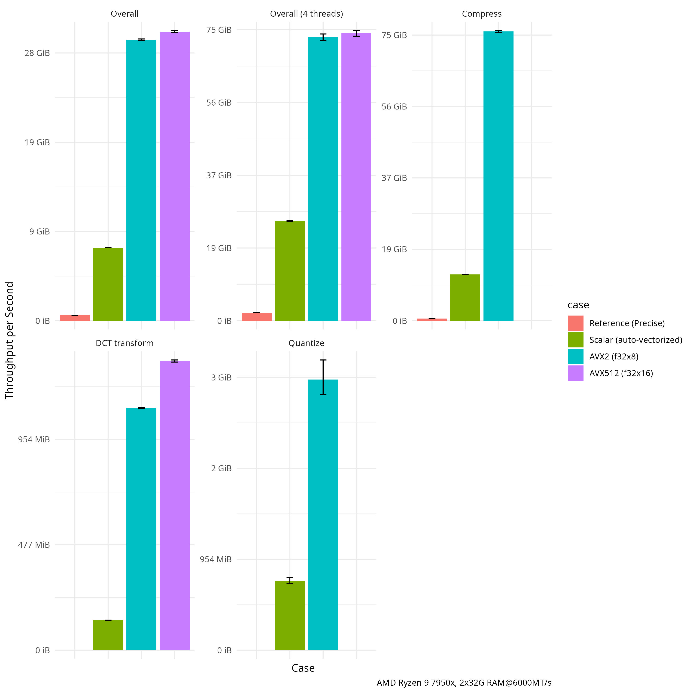

# yume-pdq

A hand-vectorized implementation of the Facebook Perceptual Hash ([PDQ](https://github.com/facebook/ThreatExchange/tree/main/pdq)) estimation algorithm that prioritizes throughput over precision.

Warning: This should be fully functional to my standards, but I am holding off publishing it to crates.io for a few days to finalize some design decisions.

TODO:

- [ ] Organize the build script.

## Design Goals

Be _accurate enough_ for high-throughput screening. At present, a test image usually result in ~12 bits different from @darwinium-com's [pdqhash](https://crates.io/crates/pdqhash) reference implementation, the official docs require 10 bits to be considered "correct". However the threshold for matching is 31 bits so we consider this not important for the purpose of matching.

Parallelize well up to the memory bandwidth limit.

Not bit-identical to the reference implementation.

Zero dependencies in the final binary (including statically linked crates).

No-std support.

## Benchmark

Generated by criterion on an AMD Ryzen 9 7950X (Zen 4) with two 32GiB DDR5 6000MT/s RAM, empty cells below means there are no hand-tuned implementation for that operation.

| Bandwidth                        | Reference (Precise)                  | Scalar                               | AVX2                                 | AVX512                               |
| -------------------------------- | ------------------------------------ | ------------------------------------ | ------------------------------------ | ------------------------------------ |
| dct2d                            |                                      | (142.0MiB/s, 142.0MiB/s, 142.3MiB/s) | (1.147GiB/s, 1.150GiB/s, 1.151GiB/s) | (1.366GiB/s, 1.372GiB/s, 1.376GiB/s) |
| jarosz_compress                  | (619.9MiB/s, 620.5MiB/s, 621.0MiB/s) | (13.00GiB/s, 12.99GiB/s, 13.02GiB/s) | (80.78GiB/s, 81.03GiB/s, 81.27GiB/s) |                                      |
| quantize                         |                                      | (731.4MiB/s, 762.6MiB/s, 800.3MiB/s) | (2.811GiB/s, 2.975GiB/s, 3.191GiB/s) |                                      |
| sum_of_gradients                 |                                      | (5158GiB/s, 5163GiB/s, 5167GiB/s)    |                                      | (5156GiB/s, 5167GiB/s, 5174GiB/s)    |
| hash  overall                    | (604.2MiB/s, 604.8MiB/s, 605.4MiB/s) | (8.189GiB/s, 8.203GiB/s, 8.215GiB/s) | (31.39GiB/s, 31.48GiB/s, 31.57GiB/s) | (32.27GiB/s, 32.40GiB/s, 32.52GiB/s) |
| 4 threads (Bandwidth limit test) | (2.212GiB/s, 2.220GiB/s, 2.228GiB/s) | (27.27GiB/s, 27.43GiB/s, 27.56GiB/s) | (77.06GiB/s, 78.02GiB/s, 78.83GiB/s) | (78.21GiB/s, 79.04GiB/s, 79.79GiB/s) |

## License and attributions

This crate is licensed under the Apache 2.0 license.

Special thanks to [@darwinium-com](https://github/darwinium-com) for their [pdqhash](https://crates.io/crates/pdqhash) crate, which was a great source of inspiration and the reference kernel
was ~~shamelessly~~ copied almost verbatim from them.

> If it works why rewrite it?
>
> \- Me, probably