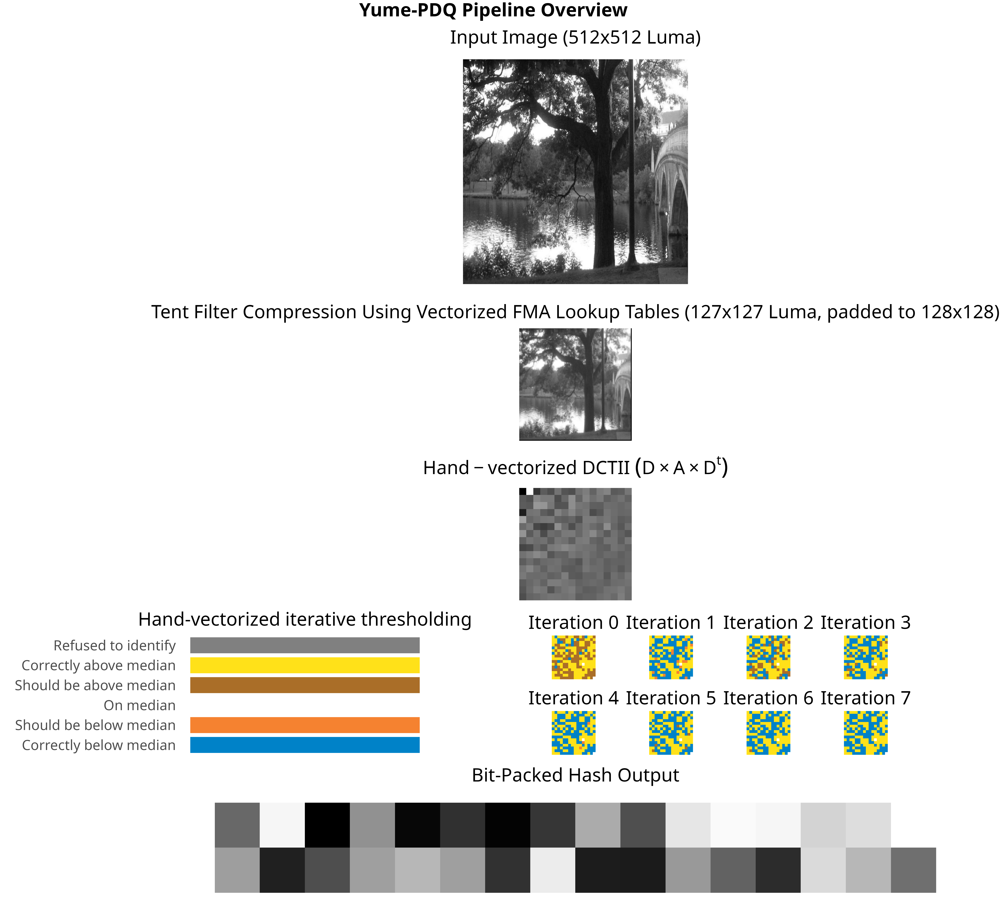

# yume-pdq

[](https://github.com/eternal-flame-AD/yume-pdq/actions/workflows/build.yml)
[](https://docs.rs/yume-pdq/)

A hand-vectorized implementation of the Facebook Perceptual Hash ([PDQ](https://github.com/facebook/ThreatExchange/tree/main/pdq)) estimation algorithm that prioritizes throughput over precision.

## Table of Contents

- [yume-pdq](#yume-pdq)
  - [Table of Contents](#table-of-contents)
  - [Pipeline Overview](#pipeline-overview)
  - [Design Goals](#design-goals)
  - [Binary usage](#binary-usage)
  - [FFI (C/Python) usage](#ffi-cpython-usage)
  - [Benchmark](#benchmark)
    - [Formal](#formal)
    - [Empirical / End-to-end](#empirical--end-to-end)
      - [Video Processing](#video-processing)
      - [Image Processing](#image-processing)
  - [Accuracy on test set](#accuracy-on-test-set)
  - [API Usage](#api-usage)
  - [License and attributions](#license-and-attributions)

## Pipeline Overview



## Design Goals

Be _accurate enough_ for high-throughput screening. At present, the official docs require 10 bits when quality > 0.8 to be considered "correct" and we are currently right on the border (see [Accuracy on test set](#accuracy-on-test-set)). However the threshold for matching is 31 bits so we consider this not important for the purpose of matching.

Parallelize well up to the memory bandwidth limit.

Not bit-identical to the reference implementation.

Zero dependencies in the final binary (including statically linked crates).

No-std support.

## Binary usage

Prerequisites:
- Rust toolchain (2024 edition or newer (1.85.0 or newer))
- A CPU that is supported by the Rust toolchain (of course)
- To use f32x8 SIMD kernel, you need an x86_64 CPU with AVX2 and FMA support
- To use f32x16 SIMD kernel, you need an x86_64 CPU with AVX512F support (usually every single AVX512 CPU supports this)

To save cloning this repo if you just want a published version (check on [crates.io](https://crates.io/crates/yume-pdq)), replace `cargo build --release` with `cargo install yume-pdq[@<version>]`.

Compilation for your own CPU (AVX2 if available, falls back to an auto-vectorized scalar kernel) is done usually with:

```bash
RUSTFLAGS="-Ctarget-cpu=native" cargo build --release --features "cli"
```

If you want a generic binary that only assumes AVX2 and FMA is available to use the optimized kernel, you can build with:

```bash
RUSTFLAGS="-Ctarget-feature=+avx2,+fma" cargo build --release --features "cli"
```

If your CPU has AVX512, you can also try (with a Rust nightly compiler):

```bash
RUSTFLAGS="-Ctarget-cpu=native" cargo +nightly build --release --features "cli avx512"
RUSTFLAGS="-Ctarget-feature=+avx512f" cargo +nightly build --release --features "cli avx512"
```

and see if it is faster, it may not be, especially with older generations of AVX512 CPUs, and it makes the final binary highly specific to your CPU (even other AVX512 CPUs may get #UD on your `-Ctarget-cpu=native` binary).


See [binary_usage.md](binary_usage.md) or the CLI help menu for details and practical examples.

## FFI (C/Python) usage

This library can be built as a shared object that can be used by C/Python applications, or a static library that can be linked into your systems programming application.

Currently there is only one exported symbol.

See [integration/c.c](integration/c.c) for an example of how to use this library from C.

See [integration/python.py](integration/python.py) for an example of how to use this library from Python.

You can download a pre-built AVX2 shared object from GitHub release artifacts but I recommend building it for your specific machine for best assurance that it would work and performance.

```py
python integration/hash.py test-data/aaa-orig.jpg
Image: test-data/aaa-orig.jpg
Quality: 1.000
Threshold: 12.554
Hash: 58f8f0cee0f4a84f06370a32038f67f0b36e2ed596621e1d33e6b39c4e9c9b22
Starting 1000 iterations
Finished 1000 iterations
Average Time taken: 6628.865 us
Average conversion time: 6546.036 us
Average hash time: 80.998 us
```

## Benchmark

### Formal

Generated by criterion on an AMD Ryzen 9 7950X (Zen 4) with two 32GiB DDR5 6000MT/s RAM, empty places below means there are no hand-tuned implementation for that operation (i.e. that operation is "downgraded" to the next most vectorized implementation).

|                                                             |                                                 |
| ----------------------------------------------------------- | ----------------------------------------------- |
|  |     |
|              |  |


### Empirical / End-to-end

#### Video Processing

Two different sources are used to test the end-to-end performance of the final CLI binary that ingest raw video frames.

Random source is generated by `yume-pdq random-stream`, FFMPEG SMPTE is a constant stream of SMPTE bars generated with:

```sh
ffmpeg -hide_banner -loglevel error -f lavfi -i testsrc=size=512x512:rate=1  -pix_fmt gray  -f rawvideo -
```

Finally each kernel is tested against both sources. FPS was collected by running `yume-pdq pipe --stats` and recording the output.

| Vectorization | Random Source | FFMPEG SMPTE |
| ------------- | ------------- | ------------ |
| AVX512        | 7900 fps      | 4050 fps     |
| AVX2          | 7100 fps      | 4100 fps     |
| Scalar        | 1600 fps      | 1500 fps     |

AVX2 was able to saturate the speed FFMPEG can generate SMPTE bars.

Additionally, the format of the output (hex, binary, or raw, or prefixed with a quality score) does not significantly affect the throughput except the 7600 fps cases.

> **Note for HPC Environment Users**: If you're fortunate enough to be running this on a high core count (>32 physical cores) low frequency (<3GHz) server-grade CPU like a Intel (R) Xeon Gold, AMD (R) EPYC 7000 and 9000 series (I envy you!), you might notice unexpectedly lower single thread/process performance (5-10 times lower than the above numbers). These CPUs are optimized for parallel throughput rather than single-thread speed. For optimal throughput:
> - Each binary is a duo-thread ping-pong buffer, so you can spawn multiple processes and pin each them to specific cores on the same NUMA node and share cache (there is a CLI flag `--core0 / --core1` to help with this when you build with `--features hpc`) 
> - Multiple AVX2 processes often outperform a single AVX512 process, this is true AFAIK (I never touched such a system with a CPU released in the last 4 years so not sure about the latest generation)
> - If you can afford this CPU, you probably already knew this, if you are on a shared system (like a supercomputer) you might want to consult with your system administrator by showing them this document which should help your administrator understand the architectural need to tune your system for this workload.

#### Image Processing

When using the imagemagick `convert` command default resizing kernel (Mitchell-Netravali) is used, 1000 images are processed in 26 seconds.

```bash
for i in (seq 1 1000); ln -s (realpath test-data/aaa-orig.jpg) /tmp/test/$i.jpg; end

time convert 'test-data/*' -resize 512x512! -colorspace gray -depth 8 gray:-  | yume-pdq pipe -f 'hex+lf'

Executed in   26.01 secs    fish           external
usr time   47.76 secs    0.00 millis   47.76 secs
sys time    9.43 secs    2.77 millis    9.43 secs
```

## Accuracy on test set

The accuracy was done by writing unit tests that do pairwise comparison with either the "pdqhash" high level API or the 32-bit floating point reference implementation or the 96-bit floating point reference implementation.

Note higher distance to the `pdqhash` library is expected as they have mandatory preprocessing steps that cannot be slipped by the exposed API. The "reference" implementation is a more faithful pairwise comparison.

| Image                                                 | Kernel  | Distance vs pdqhash lib | Distance vs Ref32 | Distance vs Ref96 |
| ----------------------------------------------------- | ------- | ----------------------- | ----------------- | ----------------- |
| aaa-orig.jpg (real photo, official test vector)       | AVX2    | 6/256 (2.3%)            | 4/256 (1.6%)      | 4/256 (1.6%)      |
|                                                       | AVX512  | 6/256 (2.3%)            | 4/256 (1.6%)      | 4/256 (1.6%)      |
|                                                       | Default | 6/256 (2.3%)            | 4/256 (1.6%)      | 4/256 (1.6%)      |
|                                                       | Ref32   | 6/256 (2.3%)            | -                 | 0/256 (0.0%)      |
| anime.png (it's anime)                                | AVX2    | 16/256 (6.2%)           | 10/256 (3.9%)     | 10/256 (3.9%)     |
|                                                       | AVX512  | 16/256 (6.2%)           | 10/256 (3.9%)     | 10/256 (3.9%)     |
|                                                       | Default | 16/256 (6.2%)           | 10/256 (3.9%)     | 10/256 (3.9%)     |
|                                                       | Ref32   | 16/256 (6.2%)           | -                 | 0/256 (0.0%)      |
| music.png (Music Video screenshot)                    | AVX2    | 10/256 (3.9%)           | 8/256 (3.1%)      | 8/256 (3.1%)      |
|                                                       | AVX512  | 10/256 (3.9%)           | 8/256 (3.1%)      | 8/256 (3.1%)      |
|                                                       | Default | 10/256 (3.9%)           | 8/256 (3.1%)      | 8/256 (3.1%)      |
|                                                       | Ref32   | 10/256 (3.9%)           | -                 | 0/256 (0.0%)      |
| neofetch.png (neofetch screenshot, low-entropy image) | AVX2    | 27/256 (10.5%)          | 10/256 (3.9%)     | 11/256 (4.3%)     |
|                                                       | AVX512  | 27/256 (10.5%)          | 10/256 (3.9%)     | 11/256 (4.3%)     |
|                                                       | Default | 26/256 (10.2%)          | 10/256 (3.9%)     | 10/256 (3.9%)     |
|                                                       | Ref32   | -                       | -                 | 0/256 (0.0%)      |

## API Usage

The Rust API is fully generic over almost all possible parameters, so you don't need to remember constants or write these magic numbers in your code, you can just use type inference provided by generic_array and typenum crates.

```rust
use generic_array::sequence::{Flatten, GenericSequence};
use core::f32::consts::PI; // no-std compatible (except the printing part)
use yume_pdq::{GenericArray, smart_kernel};

fn main() {
    // Fill with horizontal FM pattern - expect a strong horizontal frequency component in the DCT response
    // this demonstrates the "thing" DCT does: "it 'unwraps' one level of frequency domain information into spatial domain"
    // if we just do a sine wave without modulation, it will end up as a constant matrix and quality will be 0.
    let mut frequency = 4.0; // create 4 waves of stripes
    let modulation = frequency / 512.0; // make it exactly a whole number w.r.t. the matrix width so it shows up as nice vertical stripes.
    let input: GenericArray<GenericArray<f32, _>, _> = GenericArray::generate(|_| {
        GenericArray::generate(|j| {
            frequency += modulation;
            let value = ((j as f32 * 2.0 * PI * frequency) / 512.0).sin();
            // Scale to 0-255 range and center around 128
            (value * 127.0) + 128.0
        })
    });

    // Get the optimal kernel for your CPU and compile time flags
    let mut kernel = smart_kernel();

    // Allocate output and temporary buffers
    let mut output = GenericArray::default(); // Will contain the final 256-bit hash
    let mut buf1 = GenericArray::default(); // Temporary buffer
    let mut row_tmp = GenericArray::default(); // Temporary buffer
    let mut pdqf = GenericArray::default(); // Temporary buffer (PDQF unquantized hash)

    let mut threshold = 0.0; // value used for thresholding the hash, useful for doing different hashes with dihedral transformations
    // Compute the hash
    let quality = yume_pdq::hash_get_threshold(
        &mut kernel,
        &input,
        &mut threshold,
        &mut output,
        &mut buf1,
        &mut row_tmp,
        &mut pdqf,
    );

    // this does the same thing but not require you to ask for a threshold
    let quality_easy = yume_pdq::hash(
        &mut kernel,
        &input,
        &mut output,
        &mut buf1,
        &mut row_tmp,
        &mut pdqf,
    );

    assert_eq!(quality, quality_easy);

    println!(
        "Image quality score: {} (threshold at {})",
        quality, threshold
    );

    // The sine wave should create a strong response in the DCT coefficients
    // Print the unquantized hash (pdqf) to see where the energy concentrates
    println!("\nUnquantized hash (PDQF) - should show horizontal frequency component of 4 (vertical stripes):");

    for row in pdqf.iter() {
        for &val in row.iter() {
            print!("{:5.1} ", val);
        }
        println!();
    }

    /*
    You should see:
     18.5  0.1  12.2  12.9  4.9  0.4  22.4 -14.0   9.9 -0.5   18.2   18.0  0.7   5.8   19.4  -14.0
    -14.3  0.4  -7.6  13.2  0.8  0.4 -18.7 -13.8  -4.2  0.0  -13.6   18.3  7.1   5.5  -15.0  -14.1
     18.8  0.0  12.3  13.2  4.9  0.3  22.8 -14.3  10.0 -0.5   18.4   18.5  0.6   5.9   19.6  -14.4
    -14.3  0.4  -7.6  13.7  0.8  0.3 -18.7 -14.5  -4.2 -0.0  -13.7   19.1  7.1   5.7  -15.0  -14.8
     19.5 -0.0  12.5  14.1  4.7  0.3  23.6 -15.5  10.2 -0.6   18.9   19.8  0.6   6.2   20.0  -15.6
    -14.4  0.3  -7.6  15.4  0.8  0.2 -18.8 -16.6  -4.2 -0.2  -13.7   21.5  7.1   6.3  -15.1  -17.0
     22.2 -0.3  12.3  18.4  2.8  0.1  26.6 -21.0  10.5 -1.2   20.2   26.0 -0.4   7.8   20.4  -21.3
    -13.9  7.0  -7.8 -77.2  0.3  6.2 -18.5 101.0  -4.6 11.3  -14.1 -110.7  7.0 -26.7  -15.1  106.1
     17.8  0.5  15.2   7.7  9.5  0.7  21.8  -7.2  11.8  0.2   19.6   10.6  2.9   3.9   22.6   -7.0
    -14.6  0.7  -7.8  10.9  0.7  0.6 -19.1 -10.7  -4.4  0.4  -14.0   15.0  7.1   4.7  -15.4  -10.8
     21.4  0.2  16.0  12.0  8.4  0.5  25.9 -12.7  12.8 -0.3   22.1   16.8  2.4   5.6   24.4  -12.6
    -14.9  0.5  -8.0  13.5  0.7  0.5 -19.4 -13.9  -4.5  0.2  -14.3   18.7  7.1   5.6  -15.7  -14.2
     25.7  0.1  18.9  14.7  9.8  0.4  31.0 -16.0  15.3 -0.6   26.3   20.6  3.2   6.6   28.7  -16.0
    -15.3  0.3  -8.3  17.5  0.5  0.3 -20.0 -18.7  -4.7 -0.2  -14.7   24.3  7.1   7.1  -16.2  -19.1
     44.6 -0.5  32.9  24.4 17.8  0.0  53.3 -27.8  27.4 -1.8   45.3   34.1  7.6  10.3   49.3  -28.0
     -8.7  5.3  -3.5 -76.0  3.0  4.6 -12.3  95.5  -1.1  9.4   -8.6 -106.7  8.3 -26.8   -8.8   98.2
        */

    // Print the final binary hash
    println!("\nQuantized hash (binary):");
    for row in output.iter() {
        for &val in row.iter() {
            print!("{:08b} ", val);
        }
    }
    println!();

    println!("\nQuantized hash (hex):");
    for row in output.iter() {
        for &val in row.iter() {
            print!("{:02x} ", val);
        }
    }
    println!();

    let expected = [
        0x92, 0xb2, 0x7d, 0x5d, 0x38, 0x08, 0x7d, 0x5d, 0x38, 0x08, 0x7d, 0x5d, 0x38, 0x1a, 0x7d,
        0x7d, 0x92, 0xa2, 0x6d, 0x5d, 0x38, 0x18, 0x6d, 0x5d, 0x38, 0x18, 0x6d, 0x5d, 0x38, 0x18,
        0x7d, 0x5d,
    ];

    let bits_different = output
        .flatten()
        .as_slice()
        .iter()
        .zip(expected.iter())
        .map(|(a, b)| a ^ b)
        .map(u8::count_ones)
        .sum::<u32>();

    assert!(
        bits_different <= 2,
        "Hash does not match expected value ({} bits different)",
        bits_different
    );
}
```


## License and attributions

This crate is licensed under the Apache 2.0 license.

Special thanks to [@darwinium-com](https://github/darwinium-com) for their [pdqhash](https://crates.io/crates/pdqhash) crate, which was a great source of inspiration and the reference kernel
was ~~shamelessly~~ copied almost verbatim from them.

> If it works why rewrite it?
>
> \- Me, probably